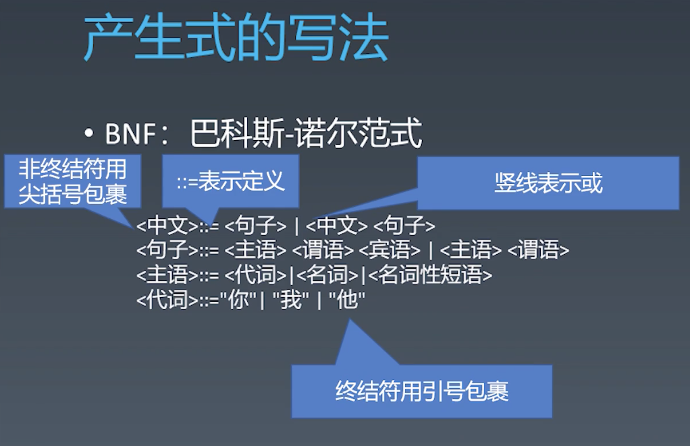
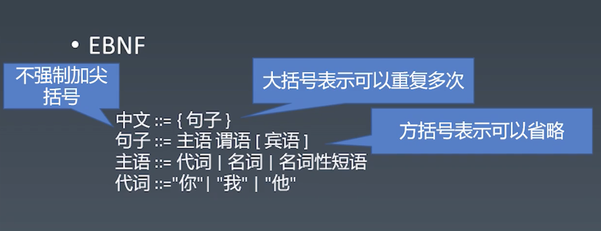
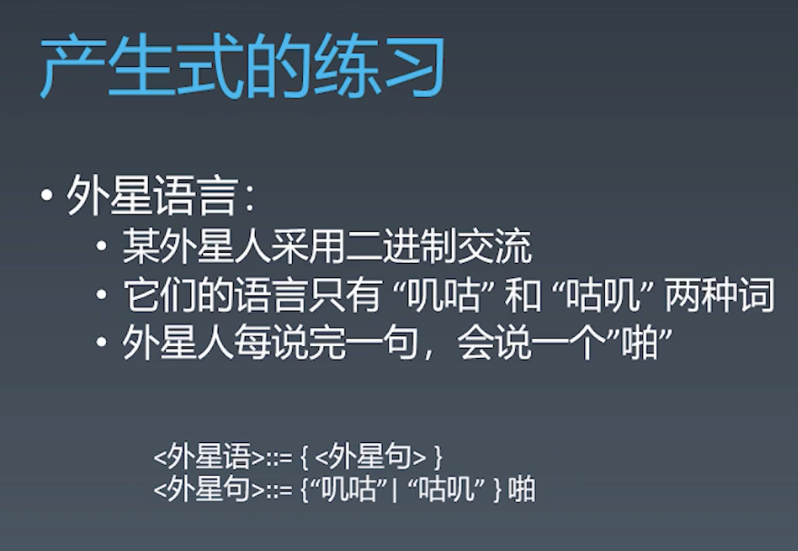
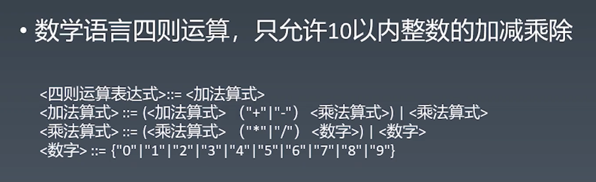
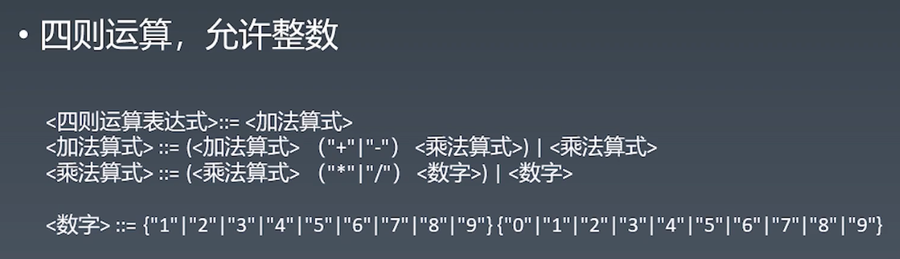

# 重学JavaScript（一）

## JS语言通识 ｜ 产生式的定义及写法
___

### 如何定义一个语言：

类似于中文的句子是一个“主谓宾”，主语可以是代词/名词/短语，代词可以是你我他。我们可以把语言拆成一个个部分，把一个语言给定义出来。

中文不够严谨，比如口语化的一些东西，但是计算机语言很严谨，可以用产生式来定义和表达。

> ### 产生式： 
> 在计算机中指 Tiger 编译器将源程序经过词法分析（Lexical Analysis）和语法分析（Syntax Analysis）后得到的一系列符合文法规则（Backus-Naur Form，BNF）的语句

> ### 符号 Symbol： 
> 定义的语法结构名称

> ### 终结符： 
> 不是由其他符号定义的符号，也就是说，他不会出现在产生式左边

> ### 非终结符： 
> 由其他符号经过“与”，“或”等逻辑组成的符号

> ### 语言定义：
> 语言可以有一个非终结符和它的产生式来定义

> ### 语法树： 
> 把一段具体的语言的文本，根据产生式以树形结构来表示出来

> ### 巴科斯诺尔范式： 
> 即巴科斯范式（英语：Backus Normal Form，缩写为 BNF）是一种用于表示上下文无关文法的语言，上下文无关文法描述了一类形式语言。它是由约翰·巴科斯（John Backus）和彼得·诺尔（Peter Naur）首先引入的用来描述计算机语言语法的符号集。
> 
> 
> JS标准也可以使用产生式进行描述
> 
> 
> 

<四则运算表达式> ::= <加法算式>
<加法算式> ::= <加法算式> ("+" | "-") <乘法算式> | <乘法算式>
<乘法算式> ::= <乘法算式> ("*" | "/") <数字> | <数字>
<数字> ::= {"1"|"2"|"3"|"4"|"5"|"6"|"7"|"8"|"9"|"0"}("."){"1"|"2"|"3"|"4"|"5"|"6"|"7"|"8"|"9"|"0"}

<四则运算表达式> ::= <加法算式>
<括号算式> ::= "(" <四则运算表达式> ")"
<加法算式> ::= <加法算式> ("+" | "-") <乘法算式> | <乘法算式>
<乘法算式> ::= <乘法算式> ("*" | "/") <数字> | <数字>
<数字> ::= {"1"|"2"|"3"|"4"|"5"|"6"|"7"|"8"|"9"|"0"}("."){"1"|"2"|"3"|"4"|"5"|"6"|"7"|"8"|"9"|"0"}
## JS语言通识 ｜ 产生式在语言中的应用
___

> ### 乔姆斯基谱系：
> 是计算机科学中刻画形式文法表达能力的一个分类谱系，是由诺姆·乔姆斯基于 1956 年提出的。它包括四个层次：
> - 0型文法（无限制文法或短语结构文法）包括所有的文法。
>    - `?::=?`，左右都随便写
> - 1型文法（上下文相关文法）生成上下文相关语言。
>    - `?<A>?::=?<B>?`，cad = cbd
> - 2型文法（上下文无关文法）生成上下文无关语言。
>    - `<A>::=?`
> - 3型文法（正规文法）生成正则语言。
>    - `<A>::=<A>?`
>    - `<A>::=?<A>`，❌ 递归前加东西不可以
> 计算机语言通常是2型或者3型

现代语言一般会分成词法和语法两个过程：

词法 lex：按照正则文法（3型）处理，lexer词法分析器进行处理
- 无效的部分（空白，注释，换行）
- Token（有效的代码部分）

语法 syntax：按照上下文无关文法（2型）处理，把token进行语法分析
- 语法树：去掉无用信息可以变成AST抽象语法树，用于代码结构处理/翻译工作，前端中babel主要做的就是这个事情

词法和语法统称文法grammar，不同的语言都有两份产生式，一份是词法产生式，一份是语法产生式。

> ###  Brainfuck ：
> 一种极小化的程序语言，它是由 Urban Müller 在 1993 年创造的。由于 fuck 在英语中是脏话，这种语言有时被称为 Brainfck 或 Brainf**，或被简称为 BF。

## Toy-JavaScript ｜ 用产生式定义JavaScript词法和语法
___

输入元素：可以是空格/换行符/注释/有效字符
> `InputElement ::= WhiteSpace | LineTerminator | Comment | Token`

空格也有很多种，单格空格，双格空格，零格空格等等
> `WhiteSpace ::= " " | "  "`

> `LineTerminator ::= "/n" | "/r"`

注释有两种：单行注释，多行注释
> `Comment ::= SingleLineComment | MultiLineComment`
> `SingleLineComment ::= "/" "/" <any>*`
> `MultiLineComment ::= "/" "*" ([^*] | "*" [^/])* "*" "/"` 
> `([^*] | "*" [^/])*` 的意思是：不是*，或者*后面不是/，这个东西可以重复多次
    

1.3 1.5 "asd" 'asda' true false等直接量literal，对象是一个复杂的语法结构，不属于词法。identifier是标识符，是我们给变量或函数起的名字
> `Token ::= Literal | Keywords | Identifier | Punctuator`

undefined不是literal，是一个变量名，它没有值，这个东西压根没有。null是有值，但是是空的。
> `Literal ::= NumberLiteral | BooleanLiteral | StringLiteral || NullLiteral`

> `Keyword ::= "if" | "else" | "for" | "function" ......`

> `Punctuator ::= "+" | "-" | "*" | "/" | "{" | "}" ......`

## Toy-JavaScript ｜ JavaScript词法基本框架
___

## Toy-JavaScript ｜ JavaScript语法基本框架
___
Program是若干语句的列表
> `Program ::= Statement+ `

> `Statement ::= ExpressionStatement | IfStatement| ForStatement | WhileStatement | VariableDeclaration | FunctionDeclaration | ClassDeclaration | BreakStatement | ContinueStatement | ReturnStatement | ThrowStatement | TryStatement | Block ....`

> `ExpressionStatement ::=  Expression ";"`

> `Expression ::=  AdditiveExpression`

> `AdditiveExpression ::= MultiplicativeExpression | AdditiveExpression ("+" | "-") MultiplicativeExpression`

> `MultiplicativeExpression ::= UnaryExpression | AdditiveExpression ("*" | "/") UnaryExpression`

UnaryExpression:单目运算
> `UnaryExpression ::=  PrimaryExpression | ("+" | "-" | "typeof") PrimaryExpression`

PrimaryExpression：优先级最高的运算，括号
> `PrimaryExpression ::=   "(" Expression ")" | Literal | Indentifier`

> `IfStatement ::= "if" "(" Expression ")" Statement`

> `Block ::=  "{" Statement "}"`

> `TryStatement ::= "try" "{" Statement+ "}" "catch" "(" Expression ")" "{" Statement+ "}"`

## Toy-JavaScript ｜ JavaScript词法和语法的代码分析（一）
___

把无意义的字符变为有意义的token和空白等代码中的基础元素