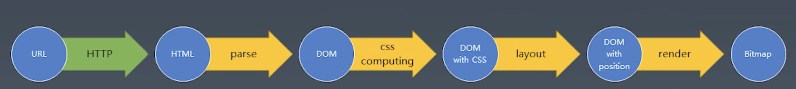

# 毕业总结

自2021年8月在极客学习以来，我觉得极客带给我的变化不仅仅是知识的提升，最大的变化是养成了学习的习惯。在繁忙的工作中也能够抽出时间来充实自己。

## 浏览器工作原理
我们从输入一个URL到实现整个页面（我们看到的页面是一个图片形式，叫做bitmap），经历一下这些过程，整个过程就是从URL到bitmap的转换过程：

- 用户先发送请求url到服务器，服务器返回HTML
- 浏览器把HTML解析，构建成DOM树
- 计算CSS属性，
- 进行排版，计算每个元素的位置
- 渲染成bitmap

## 重学JavaScript
- JS语言，产生式的写法
- 用产生式定义词法和语法
- 词法和语法的基本框架
- 词法和语法的代码分析
- 构建语法🌲
- 根据语法🌲实现语法分析
- 执行语法🌲
- 运行时的数据类型
- 添加对象类型
- 执行上下文
- 处理变量
- 表达式和运算符
- 语句块
- 作用域
- 调用和定义函数

## 组件化
- 组件基本知识
- 基本轮播组件的写法
- 手势与动画的实现
- 手势动画的应用

## 工具链与发布系统
- Yeoman
- webpack基础
- babel基础
- mocha测试
- 发布与持续集成

以上是学习的全部内容，最后一个部分由于工作和偷懒的原因目前视频还没有看完，自学部分还没开始学习，争取找时间看完。其实刚看到这个课程时，我以为课程内容对我来说会比较轻松（这每一周内容的名字起的太有欺骗性了😅），没想到内容真的是干货满满，对我来说还是有挑战的，感谢winter老师和zola小姐姐，也辛苦班班每周的提醒和督促。

