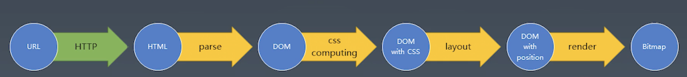

# 浏览器工作原理学习总结

## 从 URL 到 Bitmap
我们从输入一个URL到实现整个页面（我们看到的页面是一个图片形式，叫做bitmap），经历一下这些过程，整个过程就是从URL到bitmap的转换过程：

- 用户先发送请求url到服务器，服务器返回HTML
- 浏览器把HTML解析，构建成DOM树
- 计算CSS属性，
- 进行排版，计算每个元素的位置
- 渲染成bitmap

## HTTP 请求
- HTML的协议解析
- 服务端环境准备
- 实现一个HTTP的请求
- send函数的编写，了解resposnse的格式
- 发送请求
- response解析
- response body的解析

## HTML 解析
- HTML Parse模块的文件拆分
- 用FSM实现HTML
- 解析标签
- 创建元素
- 处理属性
- 用Token构建DOM树
- 将文本节点加到DOM树

## CSS 计算
- 收集css规则
- 添加调用
- 获取父元素序列
- 选择器与元素的匹配
- 计算选择器与元素匹配
- 生成computed属性
- specificity的计算逻辑

## 排版
- 根据浏览器属性进行排版
- 收集元素进行（row）
- 计算主轴
- 计算交叉轴

## 渲染
- 绘制单个元素
- 绘制DOM树

